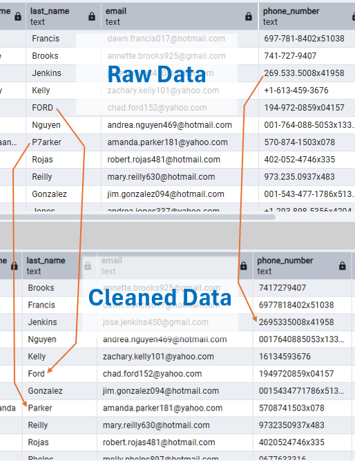

# Customer Retention Analysis

A PostgreSQL and Microsoft Excel analysis of customer purchasing behavior, digital engagement, and support experiences to identify indicators of future repeat purchasing and customer value.

## Project Overview

This project demonstrates an end-to-end customer retention analysis using PostgreSQL, Power Query, and Microsoft Excel. The analysis combines customer, order, product, digital engagement, and customer support data to evaluate how historical customer behaviors and experiences are associated with future repeat purchasing and customer value.

PostgreSQL was used to clean and transform the raw data, develop customer-level metrics, and perform the primary analytical queries. The resulting SQL outputs were imported into Excel using Power Query and used to develop a multi-page dashboard.

The project uses a historical-versus-future analysis framework to evaluate whether customer behavior observed before a defined cutoff date is associated with subsequent purchasing outcomes after said cutoff date. This approach supports the identification of customer behaviors and segments that may be useful when prioritizing future retention efforts.

---

## Business Problem and Objectives 

A B2C company requires greater visibility into the behaviors and experiences that influence customer retention and future customer value. Without a clear understanding of which customers are most likely to return and which characteristics are associated with stronger future purchasing, retention efforts may be inefficient or poorly targeted.

- Which customer behaviors and experiences are the strongest indicators of future repeat purchasing and customer value? 
- Which customer segments should the company prioritize for retention? 
- What opportunities exist to improve customer retention and prioritize retention efforts more effectively?

---

## Viewing the Report

This project is provided as an Excel workbook (.xlsx) and is intended to be viewed locally using Microsoft Excel.

To explore the dashboard:
1.	Download the CustomerRetentionAnalysis.xlsx file from this repository 
2.	Open the file using Microsoft Excel 
3.	Navigate between the dashboard pages using the worksheet tabs 
4.	Explore the visuals and insights 

---

## Dataset

This project is based on an end-to-end data ecosystem of a real B2C company, consisting of five primary tables:

- Customers (customer ID, date of birth, signup date, contact information…) 
- Orders (order ID, customer ID, order date, product ID, order amount…) 
- Products (product ID, product name, category, price…) 
- Support Requests (customer ID, request date, resolution time, sentiment…) 
- Clickstream (customer ID, timestamp, event type…)

The dataset contains customer, purchasing, digital engagement, and support activity records spanning the historical and future analysis periods used throughout the project.

The original dataset was obtained from the publicly available ‘Customer 360 dataset’ on Kaggle and was used as the starting point for this project.

Building upon the original dataset, I independently cleaned and transformed the data in PostgreSQL, developed the SQL analyses, imported the resulting outputs into Microsoft Excel using Power Query, and designed the dashboard and business insights presented throughout the project.

---

## Technical Implementation

### Data Preparation and Cleaning

The original dataset was provided as five CSV files (Customers, Orders, Products, Support Requests, and Clickstream). This raw data was then imported into PostgreSQL for cleaning.

PostgreSQL was used to prepare the data for analysis by:
- Removing duplicate customer records 
- Standardizing and validating data types 
- Cleaning and converting date fields into consistent date formats 
- Identifying and handling invalid timestamps 
- Cleaning and standardizing text values 
- Identifying and handling null and missing values 
- Validating customer, order, product, support, and clickstream records

The example below illustrates several transformations applied during data preparation/cleaning, including the standardization of customer names and phone number formatting.

The cleaned data was stored in dedicated clean tables and used as the foundation for the subsequent SQL analysis and Excel dashboard development.

### Data Modeling

Following data preparation, the cleaned tables were connected through shared customer and product identifiers to support analysis across purchasing behavior, digital engagement, and customer support activity.

The data structure is centered around the Customers table, with customer IDs linking customers to Orders, Clickstream, and Support Requests, while product IDs connect Orders to the Products table. 

### SQL Analysis 

PostgreSQL was used to perform the primary customer retention analysis and generate the outputs used throughout the Excel dashboard. A cutoff date of **December 1, 2025** was selected to maximize the historical data available for measuring customer behavior while preserving a meaningful future period for evaluating subsequent purchases and revenue.

- Historical (Behavior) Period: Before December 1, 2025
- Future (Outcome) Period: December 1, 2025 onward

The SQL analysis focused on four primary areas:

- **Customer Segmentation and Retention:** Customers were segmented using historical order frequency and purchase recency, then evaluated against future purchasing behavior and customer value.
- **Purchasing Behavior:** Historical order frequency, recency, total spending, and average order value were analyzed in relation to future repeat purchasing and revenue.
- **Digital Engagement:** Page Views, Searches, Add to Cart, Logins, and overall digital engagement were analyzed in relation to future purchasing outcomes.
- **Support Experience:** Support Request frequency, resolution time, and most recent historical support sentiment were analyzed in relation to future purchasing and customer value.

The resulting SQL outputs were imported into Excel using Power Query and used as the source data for the dashboard visualizations.

Complete SQL queries are available in the `SQL` directory.

### Microsoft Excel Implementation

The analytical outputs generated in PostgreSQL were imported into Microsoft Excel using Power Query and used as the source data for the dashboard.

Excel was then used to develop the final reporting dashboards through:
- PivotTables and supporting analysis tables
- Charts and visualizations
- Dashboard KPIs and customer segmentation
- Conditional formatting and dynamic labels
- A dedicated Insights and Recommendations page summarizing the key findings

---

## Overview of Dashboards

### Home Page

Provides an overview of customer retention performance and customer segmentation based on historical purchasing behavior. 

As the primary landing page of the report, it summarizes the analysis framework, key retention metrics, and the four customer segments used in the analysis.

### Purchasing Behavior Page

Analyzes how historical purchasing behavior relates to future customer retention. The dashboard evaluates customer return rates across purchase frequency, purchase recency, historical spending, and average order value.

### Digital Engagement Page

Analyzes how historical digital engagement relates to future customer retention and revenue. The dashboard evaluates overall engagement levels and individual digital behaviors, including ‘Page Views’, ‘Searches’, ‘Add to Cart’, and ‘Logins’.

### Support Experience Page

Analyzes how historical customer support experiences relate to future retention and revenue. The dashboard evaluates Support Request frequency, average resolution time, and support sentiment against subsequent customer outcomes.

### Insights and Recommendations Page

Consolidates the analysis into an executive summary of the key findings, recommendations, and overall conclusion. The dashboard connects insights across customer segmentation, purchasing behavior, digital engagement, and support experience to the original business question.

---

## Conclusion

This project identified purchase frequency and recency as the strongest behavioral indicators of future repeat purchasing, with higher digital engagement providing an additional retention signal. Support resolution time also showed a strong relationship with future customer value, with faster resolution associated with higher future revenue.

The analysis also demonstrated that repeat purchasing and future revenue do not always align across customer behaviors and experiences. By evaluating both retention likelihood and future customer value, the analysis provides a more complete basis for identifying retention opportunities and prioritizing customer segments.

---

## Acknowledgements

The data used in this project was obtained from a publicly available Kaggle dataset.

https://www.kaggle.com/datasets/vinaykandimalla/customer-360

