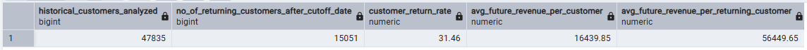
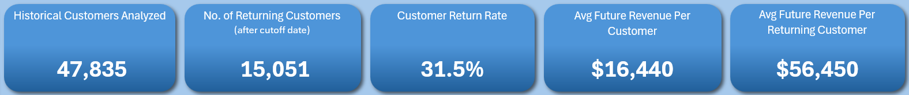
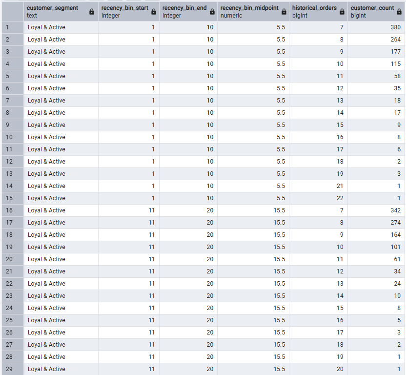
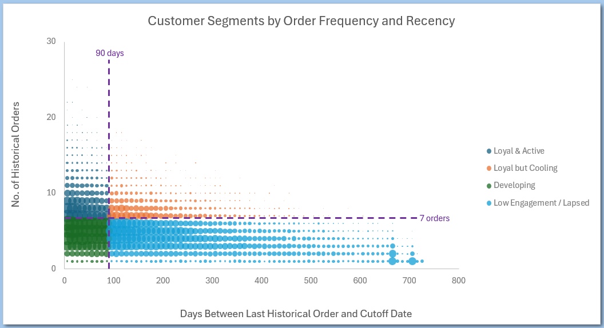
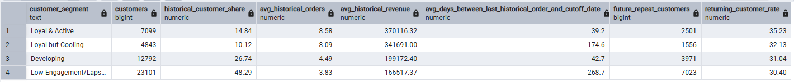
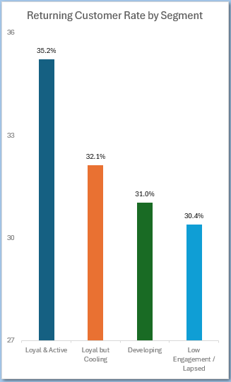
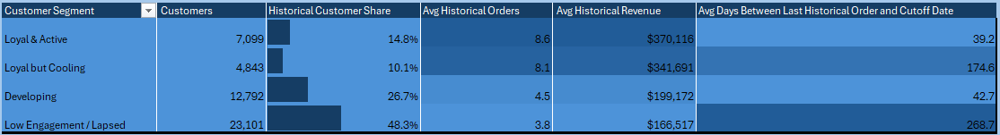

# Home Page Overview

This analysis establishes the overall customer retention metrics and customer segments used throughout the Home dashboard.

The analysis uses a cutoff date of **December 1, 2025**:

- **Historical (Behavior) Period:** Before December 1, 2025
- **Future (Outcome) Period:** December 1, 2025 onward

---

## 1. Headline KPIs

This query calculates the five headline customer retention metrics displayed in the KPIs at the top of the page.

```sql
WITH historical_customers AS (
    SELECT DISTINCT
        customer_id
    FROM clean.orders
    WHERE order_date < '2025-12-01'
      AND customer_id IS NOT NULL
),

future_activity AS (
    SELECT
        customer_id,
        COUNT(*) AS future_orders,
        SUM(order_amount) AS future_revenue
    FROM clean.orders
    WHERE order_date >= '2025-12-01'
      AND customer_id IS NOT NULL
    GROUP BY customer_id
)

SELECT
    COUNT(*) AS historical_customers_analyzed,
    COUNT(*) FILTER (
        WHERE COALESCE(f.future_orders, 0) > 0) AS no_of_returning_customers_after_cutoff_date
,
    ROUND(100.0 *
        COUNT(*) FILTER (
            WHERE COALESCE(f.future_orders, 0) > 0) / COUNT(*), 2)
                AS customer_return_rate,
    ROUND(AVG(COALESCE(f.future_revenue, 0)),2)
        AS avg_future_revenue_per_customer,
    ROUND(AVG(f.future_revenue) FILTER (WHERE COALESCE(f.future_orders, 0) > 0), 2)
        AS avg_future_revenue_per_returning_customer
FROM historical_customers h
LEFT JOIN future_activity f
    ON h.customer_id = f.customer_id;
```

### Query Output



### Dashboard Result



---

## 2. Customer Segments by Order Frequency and Recency (Bubble Chart)


This query segments customers into four retention groups based on historical purchase frequency and recency. Customers are then grouped into 10-day recency bins, with each output row representing a combination of customer segment, recency range, and historical order count. The recency-bin midpoint is used as the bubble chart's X-coordinate, historical order count as the Y-coordinate, and customer count determines the bubble size. The customer segment determines the series shown in the chart.

```sql
WITH historical_activity AS (
    SELECT
        customer_id,
        COUNT(*) AS historical_orders,
        DATE '2025-12-01' - MAX(order_date) AS days_since_last_order
    FROM clean.orders
    WHERE order_date < '2025-12-01'
      AND customer_id IS NOT NULL
    GROUP BY customer_id
),

customer_segments AS (
    SELECT
        customer_id,
        historical_orders,
        days_since_last_order,
        CASE
            WHEN historical_orders >= 7
                 AND days_since_last_order <= 90
                THEN 'Loyal & Active'
            WHEN historical_orders >= 7
                 AND days_since_last_order > 90
                THEN 'Loyal but Cooling'
            WHEN historical_orders <= 6
                 AND days_since_last_order <= 90
                THEN 'Developing'
            ELSE 'Low Engagement/Lapsed'
        END AS customer_segment
    FROM historical_activity
),

binned_customers AS (
    SELECT
        customer_segment,
        historical_orders,
        (((days_since_last_order - 1) / 10) * 10 + 1) AS recency_bin_start
    FROM customer_segments
)

SELECT
    customer_segment,
    recency_bin_start,
    recency_bin_start + 9 AS recency_bin_end,
    recency_bin_start + 4.5 AS recency_bin_midpoint,
    historical_orders,
    COUNT(*) AS customer_count
FROM binned_customers
GROUP BY
    customer_segment,
    recency_bin_start,
    historical_orders
ORDER BY
    CASE customer_segment
        WHEN 'Loyal & Active' THEN 1
        WHEN 'Loyal but Cooling' THEN 2
        WHEN 'Developing' THEN 3
        WHEN 'Low Engagement/Lapsed' THEN 4
    END,
    recency_bin_start,
    historical_orders;
```

### Query Output



### Dashboard Result



---

## 3. Returning Customer Rate by Segment (Column Chart) and Customer Segmentation PivotTable

This query summarizes each customer segment and was used for both the above mentioned column chart and PivotTable.

```sql
WITH historical_activity AS (
    SELECT
        customer_id,
        COUNT(*) AS historical_orders,
        SUM(order_amount) AS historical_revenue,
        DATE '2025-12-01' - MAX(order_date) AS days_since_last_order
    FROM clean.orders
    WHERE order_date < '2025-12-01'
      AND customer_id IS NOT NULL
    GROUP BY customer_id
),

future_activity AS (
    SELECT
        customer_id,
        COUNT(*) AS future_orders,
        SUM(order_amount) AS future_revenue
    FROM clean.orders
    WHERE order_date >= '2025-12-01'
      AND customer_id IS NOT NULL
    GROUP BY customer_id
),

customer_segments AS (
    SELECT
        h.customer_id,
        h.historical_orders,
        h.historical_revenue,
        h.days_since_last_order,
        CASE
            WHEN h.historical_orders >= 7
                 AND h.days_since_last_order <= 90
                THEN 'Loyal & Active'
            WHEN h.historical_orders >= 7
                 AND h.days_since_last_order > 90
                THEN 'Loyal but Cooling'
            WHEN h.historical_orders <= 6
                 AND h.days_since_last_order <= 90
                THEN 'Developing'
            ELSE 'Low Engagement/Lapsed'
        END AS customer_segment,
        CASE
            WHEN COALESCE(f.future_orders, 0) > 0 THEN 1
            ELSE 0
        END AS future_repeat_customer,
        COALESCE(f.future_revenue, 0) AS future_revenue
    FROM historical_activity h
    LEFT JOIN future_activity f
        ON h.customer_id = f.customer_id
)

SELECT
    customer_segment,
    COUNT(*) AS customers,
    ROUND(100.0 * COUNT(*) / SUM(COUNT(*)) OVER (), 2) AS historical_customer_share,
    ROUND(
        AVG(historical_orders), 2) 
			AS avg_historical_orders,
    ROUND(AVG(historical_revenue), 2) 
		AS avg_historical_revenue,
    ROUND(AVG(days_since_last_order), 1) 
		AS Avg_Days_Between_Last_Historical_Order_and_Cutoff_Date,
    SUM(future_repeat_customer) 
		AS future_repeat_customers,
    ROUND(100.0 * SUM(future_repeat_customer) / COUNT(*), 2) 
		AS returning_customer_rate
FROM customer_segments
GROUP BY customer_segment
ORDER BY
    CASE customer_segment
        WHEN 'Loyal & Active' THEN 1
        WHEN 'Loyal but Cooling' THEN 2
        WHEN 'Developing' THEN 3
        WHEN 'Low Engagement/Lapsed' THEN 4
    END;
```

### Query Output



### Dashboard Results




